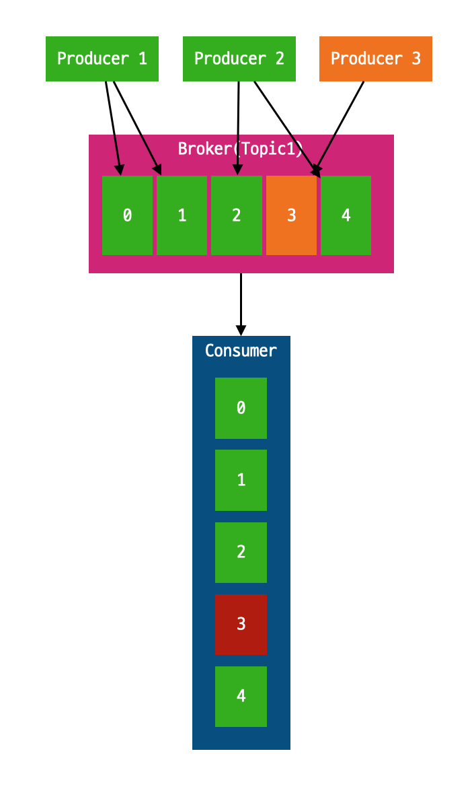

<!-- markdownlint-disable MD033 -->

# confluent platform
https://uploads-ssl.webflow.com/5f3b26c2b3bde9e2894607e8/5f6851e422d0ec638eb18b0b_Confluent%20%EC%86%8C%EA%B0%9C%20-%20website%20-%20v5.0.pdf


confluent사에서 제공하고 있는 kafka를 활용하여 여러가지 유용한 application을 제공하고 유저(개발팀, 기업)들은 다양한 라이브러리들을 개발하여 공유할수 있는 생태계

https://www.confluent.io/blog/developers-guide-confluent-community-license/

## KAFKA
https://log-laboratory.tistory.com/145?category=1109284

### 배경
그림 1-2 

2010년 이전에 운영중인 activeMQ는 느리고 큰 데이터 처리가 불가능하였다. 원본 데이터를 줄이고 포멧 변경하였지만 시간이 지날수록 비동기 작업은 많아지지만 mq 확장에 큰 어려움을 겪었다.
데이터를 축약(객체 직렬화)해서 mq에 넣었기 때문에 확장성이 부족하였고 실제로 DW와 같은 RDB에 넣기 위해서 CSV로 변환을 해야 하거나 hadoop처럼 1시간에 1번씩만 데이터를 넣어야 할 경우 데이터를 모았다가 처리하는 어플리케이션을 추가로 개발해야 했고 너무 많은 리소스를 빼았겼다

Jay Kreps, Neha Narkhede, Jun Rao는 새로운팀을 구성하여 모든 시스템으로 데이터를 전송할 수 있고 실시간 처리가 가능하며 확장이 용이한 시스템을 만들기로 하였다.
그리고 2010년에 linkedin의 서비스에 적용하였고 2011년 apache foundation에 기부하여 opensource로서 발전되어 왔다.

### 목표
- producer <-> consumer
- 여러 컨슈머에게 전달 허용
- 높은 처리량을 위한 메세지 최적화
- 스케일아웃

### 기업 사례
매출 기준 미국 100대 기업 중 60개 기업이 카프카를 이용 중이다.
netflix, airbnb, microsoft등 웬만한 IT기업에서 전사 kafka platform을 제공하고 있는 중이다.
많은 기업들이 kafka broker에 대한 운영 & 관리하는 플랫폼 조직을 운영하고 있다.

### 근황
카프카 개발팀은 링크드인을 나와 [confluent](https://confluent.io)를 창업하였고 현재 가치는 `25억불`이다.

기사 : https://jmagazine.joins.com/forbes/view/325068


## MQ 종류


- activeMQ
- zeroMQ
- rabbitMQ

https://aws.amazon.com/ko/messaging/
- amazon SQS :
- amazon MQ :
- amazon kenesis :


## message queue
### 


# Schema Registry

[Official Tutorials](https://docs.confluent.io/platform/6.1.1/schema-registry/schema_registry_tutorial.html)

## 누가

linkedin(apache kafka) -> 창업 Confluent -> Confluent Schema Registry

## 어디서


## 왜?

### Schema Evolution



producer(serializer) - consumer(deserializer)이기 때문에 데이터 형태가 변경되면(3번 메세지)consumer에서 역직렬화 오류가 발생할 수 있다.
broker를 이용하여 decoupling 하였으나 실제로는 결합도가 높은 상태라 할수 있다.

JSON일 경우는 메세지의 항목이 변경되어도 objectMapper와 같은 라이브러리에서 오류를 발생시키지 않게 할 수 있다.
하지만 런타임 오류가 발생하지 않아 담당자가 인지 못하는 큰 장애가 발생할 여지가 있다.
또한 JSON이 아닌 ByteBuffer로 처리할 경우 메세지 포멧 변경 행위는 곧 장애이다.

Schema Evolution : 상,하위 호환성을 유지하면서 스키마 변경이 가능. 상위 호환성은 이전 어플리케이션이 새로운 메세지를 읽을 수 있고 하위 호환성은 새로운 어플리케이션이 이전 메세지를 읽을 수 있는것을 의미한다.
<br/><br/>

---
스키마 호환성은 크게 4가지이며

- Backward
    - 이전 스키마를 처리할 수 있다.
    - 필드 삭제, 기본값이 있는 필드를 추가
- Forward
    - 새로운 스키마를 처리할 수 있다.
    - 필드 추가, 기본 값이 있는 필드 삭제
- FUll
    - Backward + Forward
    - 기본 값이 있는 필드를 추가 or 삭제
- None
    - 호환성 체크를 하지 않음

---
  

### network resources

```json
{"productNo": 12345, "ProductName": "아이폰11g"}
```

schema registry를 이용하면 `12345 아이폰11g`만 전송하면 되기 때문에 대량으로 발행되는 토픽 또는 큰 사이즈의 메세지가 전송 되는 경우 트래픽 비용을 상당히 줄일 수 있다.

## Features

Schema Registry : 개발자를 위한 restful interface를 제공하는 중앙 레파지토리이며 표준 스키마를 정의하고 호환성을 위한 어플리케이션을 등록한다.


Schema Validation : Kafka broker 와 Schema Registry 사이에 다이렉트 인터페이스 제공, 스키마 호환성 규칙 강제. 운영자가 따로 있어야 한다.


Control Center : web ui를 제공하며 topic schema를 등록, 수정, 조회 기능과 스키마 버전을 비교 기능을 이용할 수 있다.


**엔터프리이즈 라이센스이다. -_-; 유료 이며 아래 restapi를 이용하여 postman으로 등록하던가 오픈소스 web client를 이용하자.**


<br/><br/>

## serialization formats

- Avro (Apache) : writer's schema, reader's schema가 동일하지 않아도 된다. 호환 가능하면 됨. 디코딩시 읽기, 쓰기 스키마를 분석하여 쓰기 -> 읽기 스키마로 데이터를 transfrom
- Avro를 사용한 이유 : protobuf, thrift가 아니고 왜 Avro? linkedin에서 데이터 파이프라인 표준이 Avro라서 그렇게 쓰여진듯함. JSON 스키마 정의가 가능하고 압축률이 빠르다.


## 참고 url

[restful API](https://docs.confluent.io/platform/current/schema-registry/develop/api.html)

[opensource web ui](https://docs.confluent.io/platform/current/schema-registry/develop/api.html)

[schema-registry.properties](https://docs.confluent.io/platform/current/schema-registry/installation/config.html)

## 설치

docker-compose up

## 스키마 설계

https://toolslick.com/generation/metadata/avro-schema-from-json

스키마 설계시 고려사항

- 삭제될수 있는 필드 -> default value
- 추가 필드 -> default value
- Enum 은 변경될 가능성이 없는 경우
- 필드 name 변경 불가 정책(오직 추가, 삭제)

> 참고하자
https://medium.com/@gaemi/kafka-%EC%99%80-confluent-schema-registry-%EB%A5%BC-%EC%82%AC%EC%9A%A9%ED%95%9C-%EC%8A%A4%ED%82%A4%EB%A7%88-%EA%B4%80%EB%A6%AC-2-bfa96622a974


https://github.com/davidmc24/gradle-avro-plugin


curl -X GET http://localhost:8084/subjects


*****수정 ****

N개의 Producer에서 `order-transaction-topic`으로 메세지를 broker로 발행한다.
consumer는 순차적으로 메세지를 polling한다.
이떄 특정 producer가 메세지 항목이 달라지면 cosumer에서는 오류가 발생한다.

## Spring Cloud Schema Registry

낄낄빠빠..
spring cloud stream안에 포함되어있으며 단독으로 사용할수도 있다.

https://docs.spring.io/spring-cloud-schema-registry/docs/1.1.3-SNAPSHOT/reference/html/spring-cloud-schema-registry.html


## Kafka Connect

## Todo

1. http -> broker -> flatFIle
2. mysql -> broker -> redis
3. schema registry 설정


## 운영 규칙
producer, consumer 개발시 스키마 명세를 schema registry에서 받아서 처리할것. (직렬, 역직렬화)


https://cwiki.apache.org/confluence/display/KAFKA/KIP-98+-+Exactly+Once+Delivery+and+Transactional+Messaging
